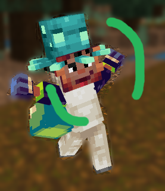

# The EmoteCommands Plugin

<strong>
This Plugin runs commands when a player does a certain emote

You will need a pocketmine server of at least version 4.0.0</strong>

# Usage

- `/makeemotecommand <name>` create new EmoteCommand with that `name`
- `/removeemotecommand <name>` remove EmoteCommand named `name`

# TODOs

- [x] Load commands to run from config file
- [x] Create command to manage emote-commands

# Future Improvements

- [ ] Run commands as server
- [ ] Have players change what emote fires an EmoteCommand for them
